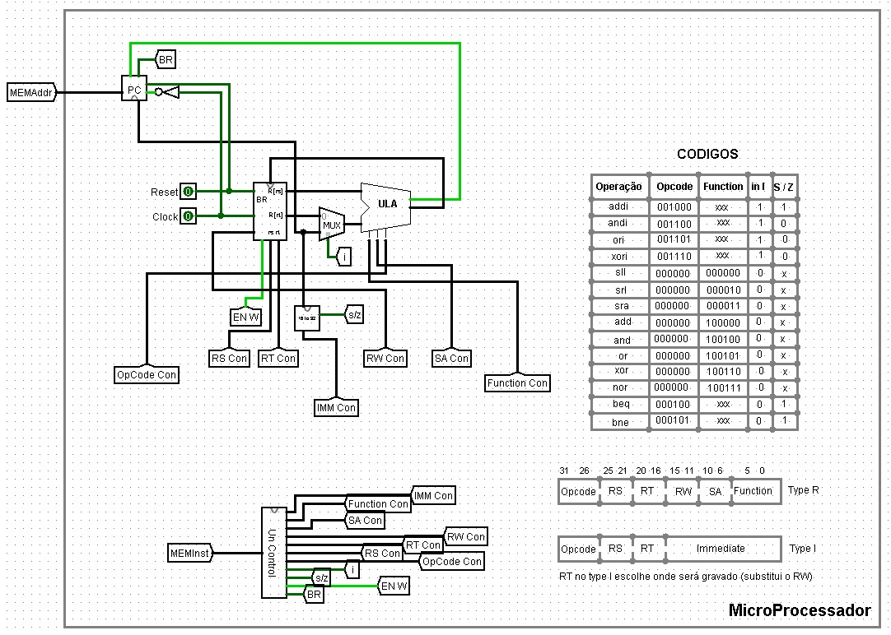
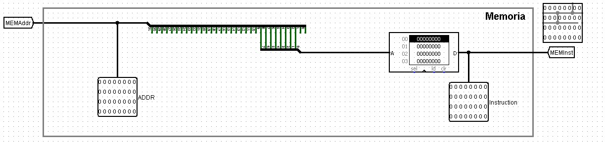

# ULA de 32 bits

## Projeto de Sistemas Digitais
Esse projeto foi desenvolvido na disciplina de Sistemas Digitais com o objetivo de criar uma Unidade Lógica Aritmética (ULA) de 32 bits utilizando o simulador **Logisim**

## Descrição
A ULA é responsável por realizar operações aritméticas e lógicas em um processador

### MicroProcessador

### Memoria

